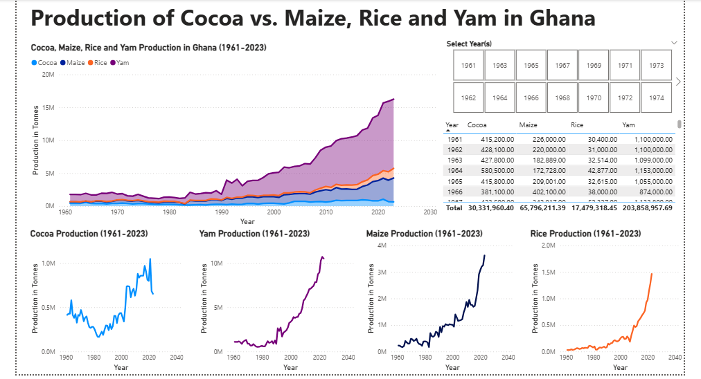
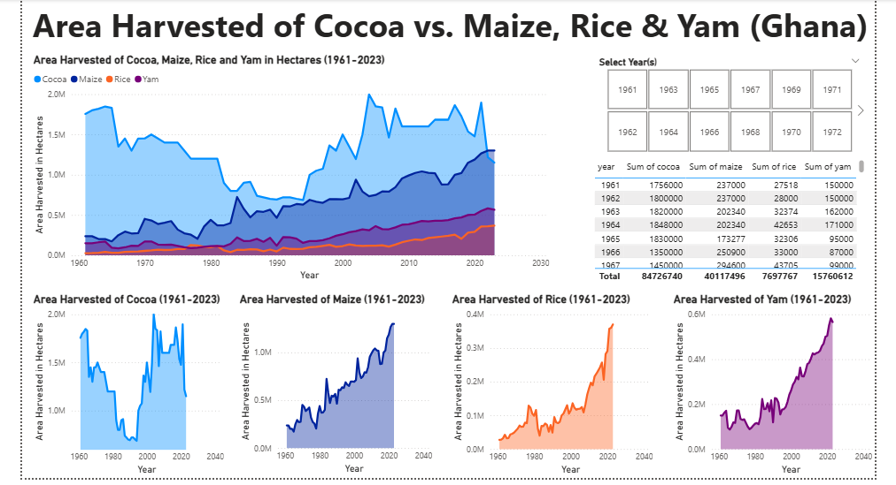
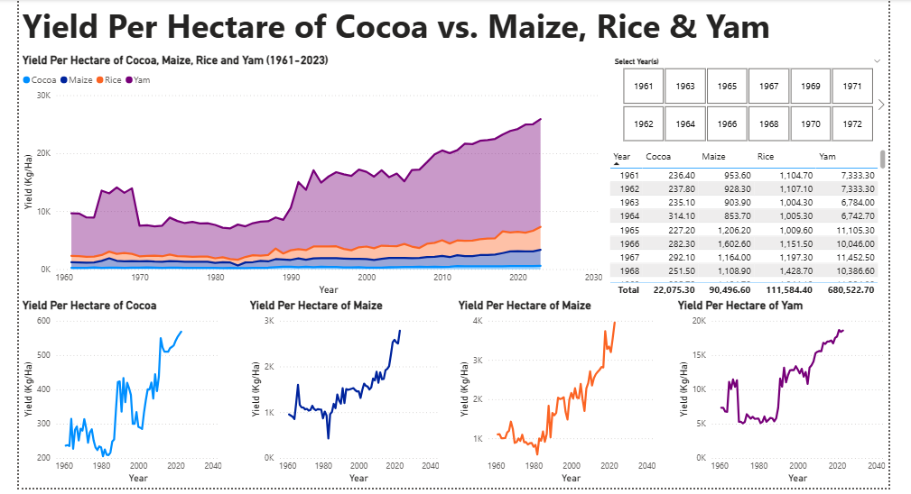
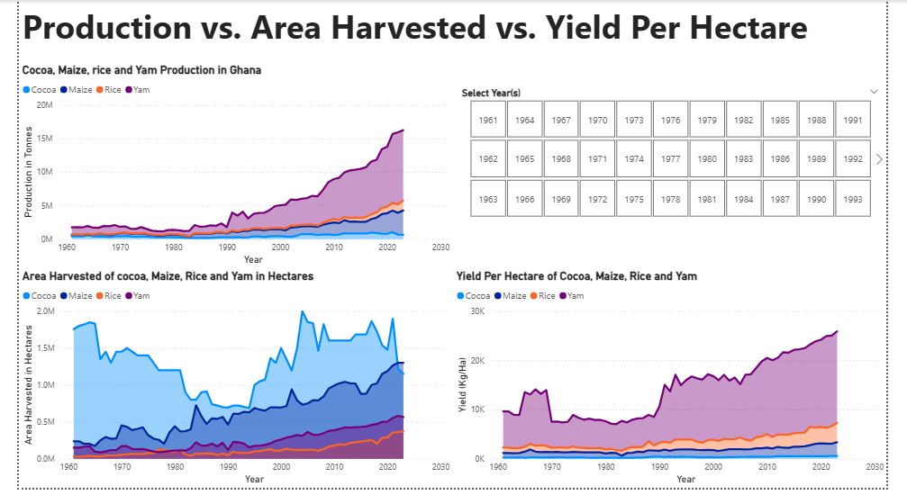
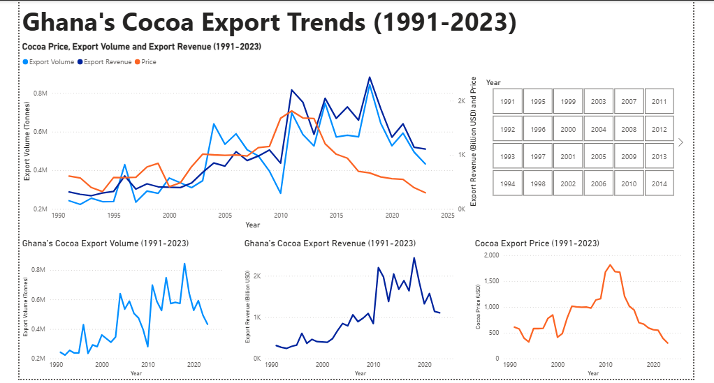
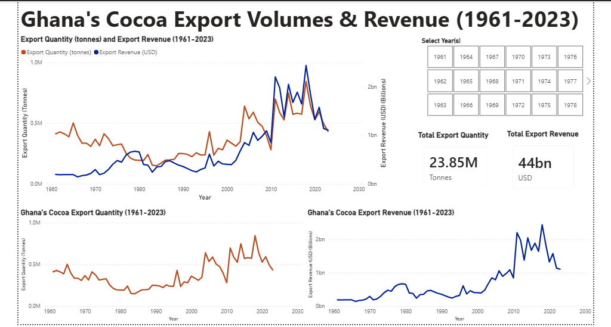
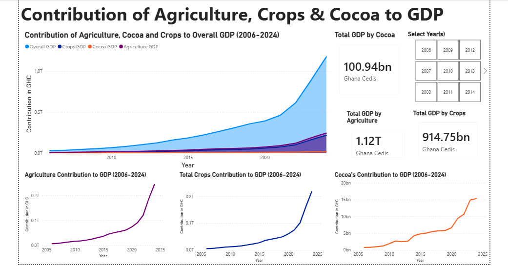

# Ghana Agriculture Sector Analysis
### Power BI Dashboards + Python Statistical Validation | Amalitech Ghana Internship

&gt; **63 years of agricultural data (1961-2023)** analyzed for government policy recommendations during Data Analytics Internship at Amalitech Ghana.

---

## Live Power BI Reports

Access the interactive dashboards online:

| Dashboard | Description | Live Report Link |
|-----------|-------------|------------------|
| **Production & Area Trends** | Production volumes, area harvested, yield analysis across 4 crops | [View Report](https://app.powerbi.com/view?r=eyJrIjoiZjA0ZTFkNTktNjhhMy00Y2M2LWIyZmEtMDgwY2RmMWVhNDNmIiwidCI6IjlmMmM4YWY3LTBmZGYtNGFlMC05ZjkyLWYyNmU0YWE2YjZkMSJ9) |
| **Export Trends** | Cocoa export volumes, revenue, and price trends (1991-2023) | [View Report](https://app.powerbi.com/view?r=eyJrIjoiNTg1MTZlZGItMzdkMi00YjQ2LWI3NDQtMjU3YWYwOGRiMmM1IiwidCI6IjlmMmM4YWY3LTBmZGYtNGFlMC05ZjkyLWYyNmU0YWE2YjZkMSJ9) |
| **GDP Contribution** | Agriculture and cocoa contribution to Ghana's GDP (2006-2024) | [View Report](https://app.powerbi.com/view?r=eyJrIjoiZmI4NWQxNDMtM2M0YS00MzFkLWFhZDMtZDgwYzkzODZlNDdkIiwidCI6IjlmMmM4YWY3LTBmZGYtNGFlMC05ZjkyLWYyNmU0YWE2YjZkMSJ9) |

---

## Dashboard Screenshots

### Dashboard 1: Production & Area Trends
*[Live Report](https://app.powerbi.com/view?r=eyJrIjoiZjA0ZTFkNTktNjhhMy00Y2M2LWIyZmEtMDgwY2RmMWVhNDNmIiwidCI6IjlmMmM4YWY3LTBmZGYtNGFlMC05ZjkyLWYyNmU0YWE2YjZkMSJ9)*

#### Page 1: Production Volumes
Production trends for Cocoa, Maize, Rice, and Yam (1961-2023)

#### Page 2: Area Harvested
Land allocation trends showing cocoa stagnation vs. food crop expansion

#### Page 3: Yield Per Hectare
Productivity improvements across all four crops over 63 years

#### Page 4: Production vs Area vs Yield Comparison
Three-panel comparative analysis showing relationships between metrics

**Key Visual Findings:**
| Finding | Implication |
|---------|-------------|
| Maize, Rice, Yam show dramatic upward production trends | Food security crops expanding rapidly |
| Cocoa production more volatile and slower growing | Export crop facing structural challenges |
| **Cocoa area harvested virtually flat (r=0.16)** | **Cannot grow production through land expansion** |
| Maize, Rice, Yam area expanding dramatically (r&gt;0.85) | Land allocation shifting toward food crops |

---

### Dashboard 2: Export Trends
*[Live Report](https://app.powerbi.com/view?r=eyJrIjoiNTg1MTZlZGItMzdkMi00YjQ2LWI3NDQtMjU3YWYwOGRiMmM1IiwidCI6IjlmMmM4YWY3LTBmZGYtNGFlMC05ZjkyLWYyNmU0YWE2YjZkMSJ9)*

#### Page 1: Export Volume, Revenue & Price Trends
Year-over-year analysis with interactive year slicer (1991-2023)

#### Page 2: Export Totals Overview
Aggregate statistics: 23.85M tonnes total volume, $44B total revenue

**Key Visual Findings:**
| Period | Volume | Revenue | Key Drivers |
|--------|--------|---------|-------------|
| 2014 | Higher | Solid | Good weather, new farms (Volta region) |
| 2015 | Drop | Weaker | Drought, harmattan winds |
| 2016-2018 | Rebound | Sharp rise | Weather recovery, price support |
| 2019 | Drop | Decline | Production variability, price adjustments |
| **2020** | **Significant drop** | **Major decline** | **COVID-19, CSSV disease, aging farms** |
| 2021 | Partial recovery | Partial rebound | Productivity programs, seedling distribution |
| 2022-2023 | Lower | Falling further | CSSV, smuggling, financing strain, unreported outflows |

---

### Dashboard 3: GDP Contribution
*[Live Report](https://app.powerbi.com/view?r=eyJrIjoiZmI4NWQxNDMtM2M0YS00MzFkLWFhZDMtZDgwYzkzODZlNDdkIiwidCI6IjlmMmM4YWY3LTBmZGYtNGFlMC05ZjkyLWYyNmU0YWE2YjZkMSJ9)*

#### Page 1: Agriculture & Cocoa GDP Contribution
Stacked area analysis with KPI cards showing sector economic impact (2006-2024)

**Key Visual Findings:**
| Relationship | Correlation | Interpretation |
|--------------|-------------|----------------|
| Cocoa GDP vs Year | r=0.92 | Cocoa GDP growing steadily |
| Cocoa GDP vs Overall GDP | r=0.98 | Cocoa drives national economic performance |
| Cocoa GDP vs Agriculture GDP | r=0.97 | Cocoa dominates agricultural sector |
| Cocoa GDP vs Crops GDP | r=0.96 | Cocoa is central to crop-based economy |

---

## Statistical Analysis (Python)

** [View Full Analysis Notebook](notebooks/statistical_analysis.ipynb)**

### Analysis 1: Production Volume Correlations

**Correlation Matrix Results:**

| Crop Pair | r Value | Strength | Insight |
|-----------|---------|----------|---------|
| Maize - Rice | 0.97 | Very Strong | Near-perfect alignment |
| Maize - Yam | 0.97 | Very Strong | Shared production conditions |
| Rice - Yam | 0.96 | Very Strong | Synchronized expansion |
| Cocoa - Yam | 0.85 | Strong | Moderate relationship |
| Cocoa - Maize | 0.75 | Moderate | Different dynamics |
| Cocoa - Rice | 0.75 | Moderate | Less aligned with staples |

**Finding:** Maize, Rice, and Yam move in near-perfect unison (r&gt;0.96), suggesting shared agricultural conditions, policies, and climate responses. Cocoa shows weaker correlations, indicating distinct production dynamics.

---

### Analysis 2: Crop Yield Correlations with Time

**Yield Improvement Over 63 Years:**

| Crop | r with Year | Trend | Interpretation |
|------|-------------|-------|----------------|
| Rice | 0.90 | Strongest ⬆️ | Best yield gains |
| Maize | 0.85 | Strong ⬆️ | Consistent improvement |
| Cocoa | 0.84 | Strong ⬆️ | Technology adoption working |
| Yam | 0.84 | Strong ⬆️ | Farming practices improving |

**Finding:** All crops show strong, consistent yield improvements over 63 years. Technology adoption and improved farming practices are benefiting ALL crops equally—broad agricultural progress across Ghana.

---

### Analysis 3: Area Harvested Correlations ⭐ CRITICAL FINDING

**Area Expansion Over 63 Years:**

| Crop | r with Year | Trend | Status |
|------|-------------|-------|--------|
| Maize | 0.96 | Massive expansion  | **Land allocation winner** |
| Yam | 0.91 | Strong expansion  | Rapid growth |
| Rice | 0.85 | Strong expansion️ | Significant growth |
| **Cocoa** | **0.16** | **Virtually NO expansion** | **Stagnant** |

**This is the most critical finding in the entire analysis.**

While maize, yam, and rice have dramatically expanded their farmland over 63 years, cocoa's area harvested has barely changed. This reveals:

1. **Production ceiling:** Cocoa cannot grow through land expansion; only yield intensification
2. **Land constraints:** Suitable cocoa land may be fully utilized or inaccessible
3. **Policy divergence:** Food crops getting land expansion support; cocoa isn't
4. **Farmer behavior:** Possible shift from cocoa to more profitable/secure food crops

**Policy Implication:** Ghana cannot increase cocoa production simply by planting more. Yield intensification or new suitable land must be found—both more difficult than area expansion.

---

### Analysis 4: GDP Contribution Regression ⭐ STRONGEST FINDING

**Model 1: Agriculture GDP → Overall GDP**

| Metric | Value | Interpretation |
|--------|-------|----------------|
| R² | **0.996** | Agriculture explains 99.6% of GDP variation |
| Coefficient | **4.89** | GHC1 agriculture → GHC4.89 overall GDP |
| p-value | &lt;0.001 | Highly significant |
| F-statistic | 3,898 | Extremely strong model |

**Model 2: Cocoa GDP → Agriculture GDP**

| Metric | Value | Interpretation |
|--------|-------|----------------|
| R² | **0.941** | Cocoa explains 94.1% of Ag GDP variation |
| Coefficient | 13.86 | GHC1 cocoa → GHC13.86 agricultural GDP |
| p-value | &lt;0.001 | Highly significant |

**What this means:**

&gt; **Agriculture IS Ghana's economy. And cocoa IS Ghana's agriculture.**

The 4.89 multiplier is extraordinary; every Ghana Cedi in agriculture generates nearly GHC5 in overall economic activity through spillover effects (transport, processing, trade, services).

The 13.86 cocoa multiplier shows cocoa's dominance: it's not just part of agriculture; it essentially IS agricultural GDP.

---

## Key Insights Summary

| # | Insight | Evidence | Implication |
|---|---------|----------|-------------|
| 1 | **Cocoa Area Paradox** | r=0.16 with time (vs others r&gt;0.85) | Cannot grow through land expansion |
| 2 | **Economic Dependency** | Ag→GDP R²=0.996; Cocoa→Ag R²=0.941 | Extreme vulnerability to single crop |
| 3 | **GHc4.89 Multiplier** | Every GHc1 ag = GHc4.89 GDP | Agriculture = highest ROI investment |
| 4 | **Broad Progress** | All yields r&gt;0.84 with time | Development programs working |
| 5 | **Export Volatility** | 2020 COVID crash, 2022-23 structural decline | Revenue instability increasing |
| 6 | **Food Crop Growth** | Maize/Rice/Yam area r&gt;0.85 | Diversification opportunity |

---

## Recommendations Delivered to Amalitech

### Immediate (0-12 months)

**1. Invest in Productivity Enhancement**
- Improved seedlings and disease-resistant varieties
- Fertilizer support programs
- Farmer training on modern techniques
- *Target:* Address aging trees and CSSV disease reducing yields

**2. Promote Domestic Processing**
- Tax incentives for cocoa processing facilities
- Public-private partnerships for value-added products
- *Target:* Reduce export vulnerability, increase GDP contribution, stabilize income

**3. Scale Climate-Smart Agriculture**
- Irrigation infrastructure expansion
- Drought-tolerant crop varieties
- Climate-smart farming practices
- *Target:* Reduce volatility in harvested area, stabilize GDP contributions

**4. Support Staple Crop Expansion**
- Mechanization for maize, rice, yam
- Storage facilities to reduce post-harvest loss
- Input subsidies for rapidly expanding food crops
- *Target:* Reduce over-dependence on cocoa, improve food security

---

### Medium-Term (1-3 years)

**5. Policy Coordination**
- Align cocoa policies with broader agricultural strategies (PFJ, irrigation master plans)
- *Target:* Coordinated policies amplify sector-wide growth

**6. Structural Reforms**
- Land tenure reform to enable cocoa expansion
- Farm rehabilitation programs
- Youth participation incentives
- *Target:* Address structural constraints preventing cocoa area growth

**7. Modern Data Systems**
- GIS mapping of agricultural zones
- Digital farmer registries
- Real-time production monitoring
- *Target:* Improve forecasting, planning, and policy evaluation

---

### Long-Term (3-5 years)

**8. Market Stabilization & Diversification**
- Price stabilization funds
- Forward contracts for farmers
- Diversification into niche cocoa (organic, fine-flavour)
- *Target:* Protect farmers from price volatility, stabilize national revenue

---

## Project Structure
ghana-agriculture-analysis/
├── README.md
├── data/
│   ├── prod_volume.xlsx              # FAOStat production data (1961-2023)
│   ├── crops_yield.xlsx              # FAOStat yield data (1961-2023)
│   ├── area_harvested.xlsx           # FAOStat area data (1961-2023)
│   ├── gdp_contribution.xlsx         # Ghana Statistical Service GDP data (2006-2024)
│   └──export_trends.xlsx            # FAOStat export data (1991-2023)
├── powerbi/
│   ├── files/
│   │   ├── production_trends.pbix
│   │   ├── export_trends.pbix
│   │   └── gdp_contribution.pbix
│   └── screenshots/
│       ├── production_trends/
│       │   ├── production_volumes.png
│       │   ├── area_harvested.png
│       │   ├── yield_per_hectare.png
│       │   └── production_area_yield_comparison.png
│       ├── export_trends/
│       │   ├── export_volume_revenue_price.png
│       │   └── export_totals_overview.png
│       └── gdp_contribution/
│           └── gdp_contribution_overview.png
├── notebooks/
│   └── statistical_analysis.ipynb    # Python correlation & regression analysis
└──presentation/
    └── Ghana_Agriculture_Analysis_Report.pdf
	
---

## Skills Demonstrated

### Technical Skills
✅ **Power BI** (3 dashboards, DAX, data modeling, interactive visuals, published reports)  
✅ **Python** (pandas, numpy, seaborn, scipy, statsmodels)  
✅ **Statistical Analysis** (Pearson correlation, OLS regression, hypothesis testing)  
✅ **Data Visualization** (correlation heatmaps, trend charts, regression plots)  
✅ **Data Collection** (FAOStat, Ghana Statistical Service, World Bank - real-world sourcing)  
✅ **Cross-tool Validation** (Power BI visual insights → Python statistical confirmation)  

### Business Skills
✅ **Policy Analysis** (agricultural economics, development strategy)  
✅ **Executive Presentation** (delivered to Amalitech supervisors)  
✅ **Stakeholder Communication** (technical findings → business recommendations)  
✅ **Recommendation Development** (data-driven policy suggestions)  
✅ **Agricultural Domain Knowledge** (crop economics, food security, export markets)  
✅ **Economic Analysis** (GDP contribution, multiplier effects, sector interdependencies)  

---

## Data Sources

- **FAOStat** (Food and Agriculture Organization)
  - Production, yield, area harvested, export data
  - URL: https://www.fao.org/faostat/en/#data/QCL

- **Ghana Statistical Service**
  - GDP contribution data (Agriculture, Cocoa, Overall)
  - Period: 2006-2024

- **World Bank Open Data**
  - Supplementary economic indicators
  - URL: https://data.worldbank.org

**Download Date:** October 2025  
**Analysis Period:** Data spanning 1961-2023 (63 years)

---

## Authors

**Samuel Agondeze Kisoke** - Data Analyst, Statistical Analysis & Python Validation  
**Abigail Afful** - Collaborator, Research & Data Collection  

**Organization:** Amalitech Ghana (Internship Project)  
**Duration:** October - December 2025

📧 samuelasteragondeze@gmail.com  
💼 [LinkedIn](https://linkedin.com/in/samuel-agondeze-kisoke)  
🐙 [GitHub](https://github.com/dez-data)

**Other Portfolio Projects:**
- [Ghana GDP Forecasting - Time Series Analysis (R)](https://github.com/dez-data/ghana-gdp-forecasting)
- [Retail Bookkeeping System - Excel Business Tool](https://github.com/dez-data/retail-bookkeeping-system)

---

## License

MIT License - Open source and free to use.

Data sourced from public databases (FAOStat, Ghana Statistical Service, World Bank).  
Analysis, dashboards, and presentation created by Samuel Agondeze Kisoke and Abigail Afful.

---

*Completed during Data Analytics Internship at Amalitech Ghana*  
*October - December 2025*